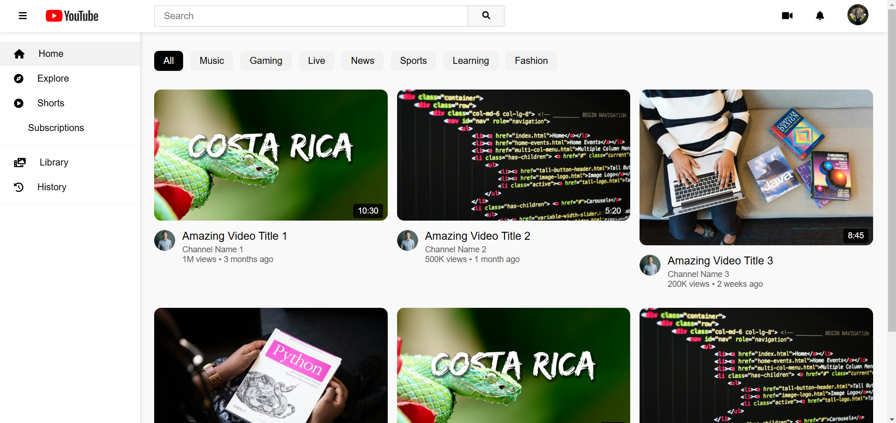

# 📺 YouTube Clone - Frontend Replica

A pixel-perfect, responsive replica of the YouTube interface built with **Vanilla HTML, CSS, and JavaScript**. <br>
This project features a dynamic video grid, collapsible sidebar, and functional search filtering.

<p>
  
  
  
  
</p>

### <a href="https://hadesoo7.github.io/youtube-clone">View Live Demo 🚀</a>

<br />

<details>
  <summary>Table of Contents</summary>
  <ol>
    <li><a href="#about-the-project">About The Project</a></li>
    <li><a href="#interface-preview">Interface Preview</a></li>
    <li><a href="#key-features">Key Features</a></li>
    <li><a href="#getting-started">Getting Started</a></li>
    <li><a href="#technologies-used">Technologies Used</a></li>
    <li><a href="#file-structure">File Structure</a></li>
    <li><a href="#code-highlight">Code Highlight</a></li>
  </ol>
</details>

---

## 🎬 About The Project

This project replicates the core look and feel of YouTube's desktop interface. It focuses on **CSS Grid and Flexbox** mastery to handle complex layouts and **DOM manipulation** to render video feeds dynamically.

It serves as a demonstration of frontend structural skills, recreating the familiar sidebar navigation, category chips, and responsive video card layouts without relying on external CSS frameworks.

## 📸 Interface Preview

<div align="center"> 
  
</div>

> *The interface features a sticky navbar, a responsive grid layout for videos, and a collapsible sidebar navigation.*

## ✨ Key Features

| Feature | Description |
| :--- | :--- |
| **Responsive Grid** | A layout that adapts from 1 column on mobile to 4+ columns on desktop screens. |
| **Dynamic Video Cards** | Video thumbnails, titles, and channel data are generated dynamically via JavaScript. |
| **Search Functionality** | Real-time filtering of the video feed based on the input in the search bar. |
| **Category Filter** | Clickable pills (e.g., "Music", "Gaming") that filter the displayed videos. |
| **Collapsible Sidebar** | A toggle button (Hamburger menu) that expands or minimizes the side navigation. |

## 🛠️ Technologies Used

* **Core:** Semantic HTML5
* **Styling:** CSS3 (Variables, Flexbox, Grid Layouts)
* **Logic:** Vanilla JavaScript (Event Listeners, Array Methods)
* **Icons:** FontAwesome 6

## 🚀 Getting Started

To run this project locally on your machine, follow these steps.

### Prerequisites
* A modern web browser (Chrome, Firefox, Safari, Edge).

### Installation

1.  **Clone the repository**
    ```sh
    git clone [https://github.com/HADESOO7/YouTube-Clone.git](https://github.com/HADESOO7/YouTube-Clone.git)
    ```
2.  **Navigate to the project directory**
    ```sh
    cd YouTube-Clone
    ```
3.  **Open the file**
    Double-click `index.html` to launch the application in your default browser.

## 📂 File Structure

```text
/youtube-clone
├── images/
│   ├── Avatar.png
│   ├── youtube-logo.png
│   └── thumbnail.jpg
├── index.html          # Main structure
├── styles.css          # Styling and layout
└── script.js           # Dynamic logic
